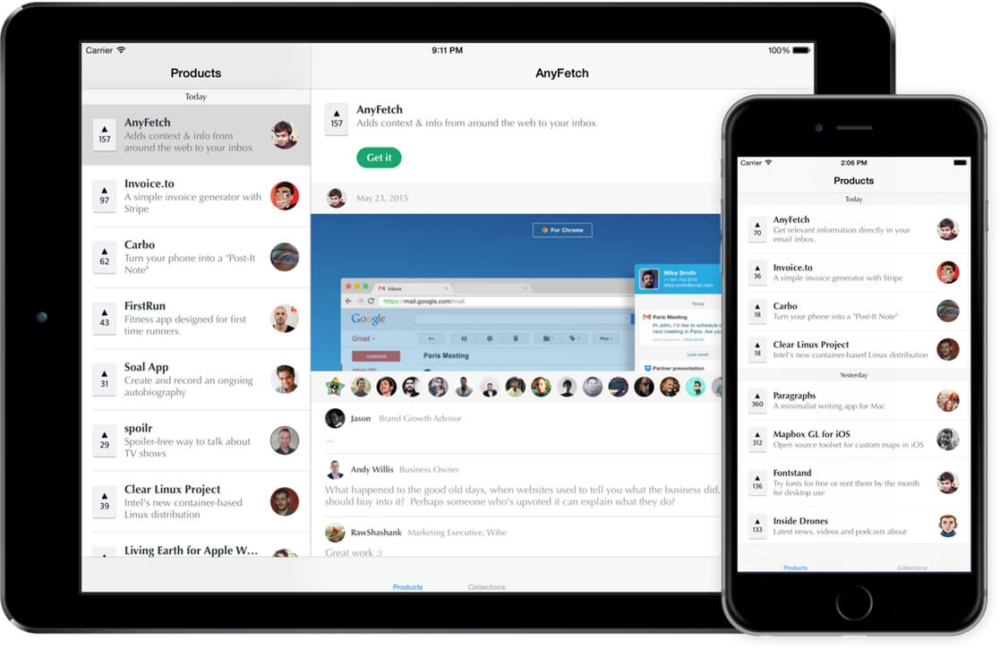

# Hunting Companion
ProductHunt example iOS Universal app using Swift and the HuntingKit framework.

<p align="center">
  
</p>

## Instructions

Make sure you have [Carthage](https://github.com/carthage/carthage) installed in your system. Then simply go into the project's folder in terminal and run:

``` ruby
carthage update
```

## Features:

The app was created as a testing example of the [HuntingKit](https://github.com/raulriera/HuntingKit) framework, but also was an attempt to recreate the official ProductHunt app as closely as possible.

It includes features like:

- Universal support
- Handoff from your device to producthunt.com
- Portrait and Landscape
- Completely Swift based
- Many more

## Disclaimer

Don't upload this to the AppStore 😅

## About:
Created by Raul Riera, [@raulriera](http://twitter.com/raulriera)
